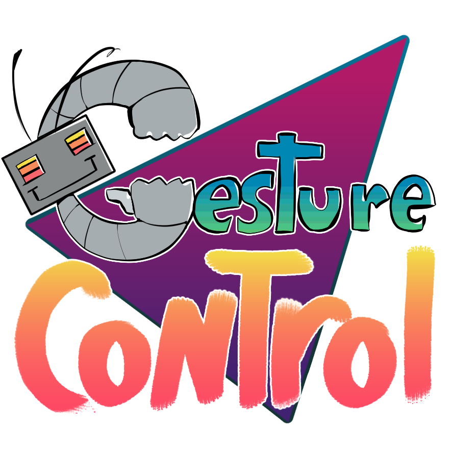

<!-- height or width of logo may be adjusted -->
<!-- This section is where you will replace the link to your transparent logo, the title of your project, and the very short desciptor of your project -->
<!-- If you used Canva to make your icon and don't want to pay for a background remover, you can use the website https://www.remove.bg/ to do so -->

  
  <h1 align="center">Teaching Sign Language Using AI Hand Tracking Technology</h1>
  
A project by Emu Unicorn Sauce 

<!-- the emojis are not set in stone! If you'd like you can remove them entirely or select your own from https://gist.github.com/rxaviers/7360908 you are welcome to -->

## :loudspeaker: About
The objective of the workshop is to showcase the use of AI hand tracking through learning sign language.
<!-- You can look at other TAP projects if you need a better idea of how to describe your workshops objectives -->

In this workshop, participants will learn sign language through the use of AI that will help guide them using hand tracking through a computer camera. They will learn how to spell one word before moving on to a fun memory game.

## :bulb: Project information
<!-- 
Your Options for target audience: 
  - High School
  - College
  - Middle School
  - K-12
  - Non-Stem
  - Undergraduate
You can select from a range of audiences or a single auidience. Examples: 
    Middle School - College 
    High School - College
    K-12
  You will be presenting most often to your peers who are taking introductory technology classes, so more often than not you should be including college in your target audience range. 
-->
* <b>Difficulty Level:</b> Beginner/Intermediate
* <b>Target Audience:</b> Middle School - College
* <b>Duration of Workshop:</b> About 1 hour
* <b>Needed Materials:</b> Computer with camera
* <b>Learning Outcomes:</b> The primary goal of this project is to teach participants about how AI tracking is being used 
* <b>Your Main Technology</b> AI hand tracking, works by using computer vision to analyze and detect an object's position
* [Technology Ambassador Program](https://tapggc.org/) <b>(TAP)</b> is a project-based class that provides a collaborative environment for students to work with their fellow classmates on a semester-long project using technologies of their choice. TAP strives to increase participation in IT through numerous outreach activities and workshops that are designed to showcase the creative and fun side of technology.
<!-- Commercial Video stored in the Media folder will be linked here -->

[Commercial Video] (https://youtu.be/laJy1elCLVc)

<!-- videos can also be dragged and dropped into markdown files if you want them embedded -->

## :pencil2: Team: Emu Unicorn Sauce

<!-- Use the team photo of your choice once youve uploaded it to the team photo folder within the media folder -->

> (From left to right: Batman,  Wonder Woman, Superman.)
<!-- replace with full names of your team members -->

* Joey Chen
* Ivana Hernandez
* Keren Zhang

## :mortar_board: Advisors
<!-- name of the two professors overseeing your TAP class -->
* Dr. Wei Jin
* Dr. Xin Xu

## :page_with_curl: Project Description
Participants begin by exploring an AI-powered hand tracking system that provides real-time feedback on their gestures. Unlike traditional sign language learning through videos, where learners often struggle to know whether their hand positions are accurate, this system uses computer vision to mirror participants’ movements and measure their accuracy.

During the workshop, learners will follow guided exercises in which an AI model recognizes their hand shapes and displays a matching 3D avatar performing the correct sign. The system highlights the percentage of accuracy (e.g., 90%, 98%, 100%) to help participants understand their progress before moving to the next gesture.

The project leverages technologies such as MediaPipe for hand tracking, allowing users to see their own skeletal hand overlay compared with the target gesture in real time. By doing so, participants not only practice sign language but also gain an interactive and immersive learning experience.

Compared to traditional methods—such as watching videos or attending in-person classes—this approach is more flexible and accessible. Learners can study anywhere, anytime, while receiving immediate feedback, which significantly increases engagement and retention. This interactive model transforms sign language learning into a process that is visual, participatory, and highly effective.
<!--keren 8.29.2025-->
In addition to practicing sign language, participants will also be introduced to the underlying technology behind the system. The workshop will cover how AI hand tracking works, including concepts of computer vision, gesture recognition, and how different components (such as MediaPipe, 3D models, and accuracy scoring) are integrated into one interactive platform. By walking through these technical elements, participants will not only experience the application but also gain insight into how to build such a system themselves.
<!--keren 8.30.2025-->
## :memo: Publications
<!-- team members, then professors/advisors. "Name of Publication", event, month and day, year, Georgia Gwinnett College. -->
1. Team Member, Team Member, Team Member, John Doe, Jane Doe. "A Real Fake Workshop", Fake Event, April 1, 2024, Georgia Gwinnett College.  

## :open_hands: Outreach
<i>List the outreach events your team has participated in. </i>

Example:

1. <b>TAP Expo</b>, April 1, 2021, Georgia Gwinnett College: to promote the IT field and encourage college students to sign up for TAP.
2. <b>Class Workshops</b>, April 13-15, 2021, Georgia Gwinnett College: to promote the IT field to non-IT students.

## :mag_right: Similar Projects
<i>Use this section to link to a project done in the TAP program that is related in some way to your own. This can be a sister project done during your TAP semester or a TAP project done in the past. Example: </i> 

If you're interested in more workshops that utilize Scratch, check it out [Space Mechanic](https://github.com/TAP-GGC/NinjaTurtles)!

## :computer: Technology
<i> Replace Scratch with whatever technology you're using and make sure to have a logo of that technology uploaded to the technology folder within the media folder. </i>
<!-- be sure to use the alt text feature in case anybody viewing your repo is using  screen reader! you want your workshop to be as accessible as possible -->

  

* [Scratch](https://scratch.mit.edu/) is a block-based programming language developed by the MIT Media Lab as an education tool for children to learn computing in a fun and interactive way.
* Scratch has drag-and-drop interfaces. Unlike text-based programming language like Java or C where you physically type every line of code, in Scratch, you can drag and drop pre-made codes and organize them into an algorithm. It's like solving a jigsaw puzzle!
* Explain why your team chose this technology for this workshop.

## Project Setup/Installation 
<i> This section is dedicated to linking to .md files in your documents/tutorial/ folder that will contain instructions on installation

Your repo doesn't have to have every section used below. This is just an example so you can get an idea of what your own repo should look like</i>

### Opening a blank Scratch page 
[Click here to view instructions](/documents/tutorial%20materials/Opening%20a%20blank%20Scratch%20page.md)

[Video with Scratch instructions](https://youtu.be/v-GUbj7DMEE)

<!-- if your project uses scratch, you can reuse any of these instructions (be sure to include CS First alternatives) -->
## CS First Installation Walkthrough
[Click here to view instructions](/documents/tutorial%20materials/CS%20FIRST/CS%20First%20Walkthrough.md)

### Getting to the game 
[Click here to view instructions](/documents/tutorial%20materials/Getting%20to%20the%20Game.md)

## How to use Gesture Control
1. Search up a the ASL alphabet and use the pictures with Gesture Control
2. Go to our website https://gesture-control-xli6.onrender.com/ <!-- Place holder link -->
3. In the dropdown menu select 'Webcam'.
4. Click 'Start Camera' and allow camera if the option appears.
5. If the status says 'Connected' Select a letter you like to sign.
6. Click 'Start Recognition'.
7. Sign the letter you picked
8. When you're done click 'Stop' next to 'Start Recognition'

## Short Demo Instructions 
[Demo Video on how to install and play our game](https://youtu.be/mA80Aa55t-U)

## Workshop Instructions 
[Click here to view workshop walkthrough pdf file](/documents/tutorial%20materials/Scratch%20Workshop%20Walkthrough.pdf)

[Our Game Workshop Video](https://youtu.be/Mtsre0iMStM)

