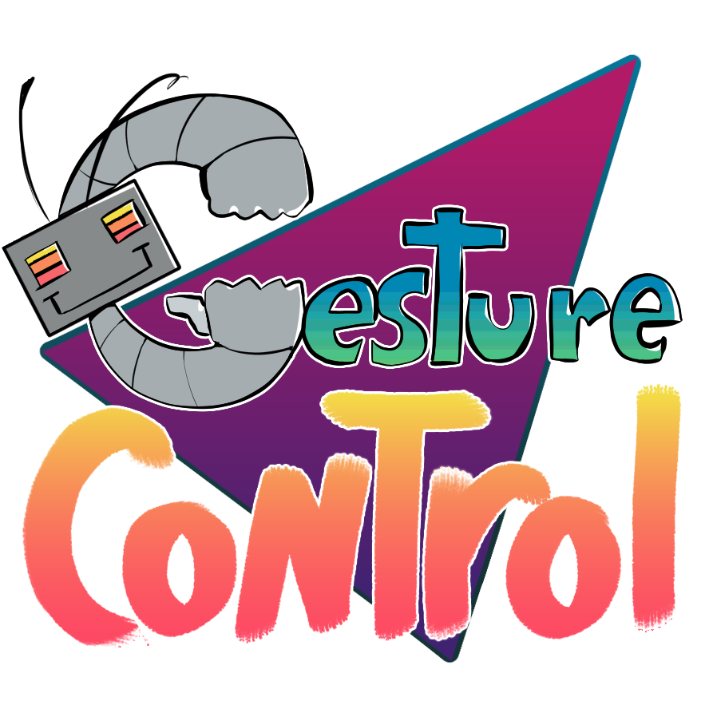
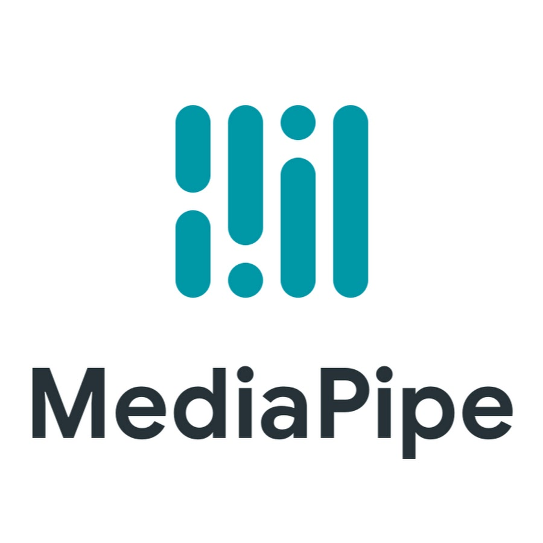
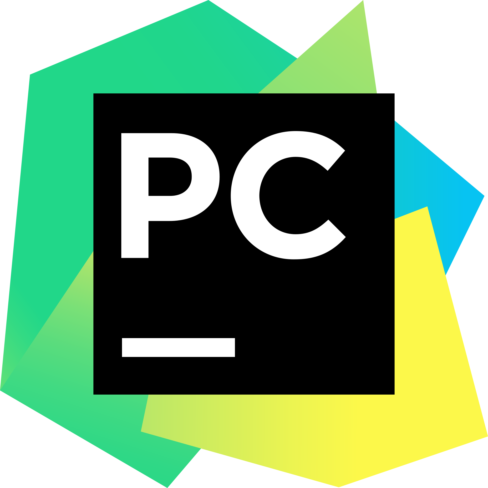

<!-- height or width of logo may be adjusted -->
<!-- This section is where you will replace the link to your transparent logo, the title of your project, and the very short desciptor of your project -->
<!-- If you used Canva to make your icon and don't want to pay for a background remover, you can use the website https://www.remove.bg/ to do so -->

  
  <h1 align="center">Teaching Sign Language Using AI Hand Tracking Technology</h1>
  
A project by Emu Unicorn Sauce 

<!-- the emojis are not set in stone! If you'd like you can remove them entirely or select your own from https://gist.github.com/rxaviers/7360908 you are welcome to -->

## :loudspeaker: About
The objective of the workshop is to showcase the use of AI hand tracking through learning sign language.

In this workshop, participants will learn the American Sign Language(ASL) alphabet through the use of AI that uses hand tracking through a computer camera. By selecting the wanted letter students and learn and practice ASL through a website.

## :bulb: Project information
<!-- 
Your Options for target audience: 
  - High School
  - College
  - Middle School
  - K-12
  - Non-Stem
  - Undergraduate
You can select from a range of audiences or a single auidience. Examples: 
    Middle School - College 
    High School - College
    K-12
  You will be presenting most often to your peers who are taking introductory technology classes, so more often than not you should be including college in your target audience range. 
-->
* <b>Difficulty Level:</b> Beginner/Intermediate
* <b>Target Audience:</b> Middle School - College
* <b>Duration of Workshop:</b> between 30 min - 45 mins
* <b>Needed Materials:</b> Computer with camera
* <b>Learning Outcomes:</b> The primary goal of this project is to teach participants about how AI tracking is being used 
* <b>Your Main Technology</b> AI hand tracking, it works by using computer vision to analyze and detect an object's position
* [Technology Ambassador Program](https://tapggc.org/) <b>(TAP)</b> is a project-based class that provides a collaborative environment for students to work with their fellow classmates on a semester-long project using technologies of their choice. TAP strives to increase participation in IT through numerous outreach activities and workshops that are designed to showcase the creative and fun side of technology.
<!-- Commercial Video stored in the Media folder will be linked here -->

[Commercial Video](https://youtu.be/laJy1elCLVc)

<!-- videos can also be dragged and dropped into markdown files if you want them embedded -->

## :pencil2: Meet the Team: Emu Unicorn Sauce

<!-- Use the team photo of your choice once youve uploaded it to the team photo folder within the media folder -->

> (From left to right: Keren Zhang, Joey Chen, Ivana Hernandez.)
<!-- replace with full names of your team members -->

* Joey Chen
* Ivana Hernandez
* Keren Zhang

## :mortar_board: Advisors
<!-- name of the two professors overseeing your TAP class -->
* Dr. Wei Jin
* Dr. Xin Xu

## :page_with_curl: Project Description
Participants begin by exploring an AI-powered hand tracking website that provides real-time feedback on their gestures. Unlike traditional sign language learning through videos, where learners often struggle to know whether their hand positions are accurate, this system uses computer vision to mirror participants’ movements and measure their accuracy.

During the workshop, students will follow guided exercises in which an AI model recognizes their hand shapes and displays hand landmarks over their hand. The system highlights the percentage of accuracy (e.g., 90%, 98%, 100%) to help participants understand their progress before moving to the next gesture.

The project leverages technologies such as MediaPipe for hand tracking, allowing users to see landmarks overlay their hand. By doing so, participants not only practice sign language but also gain an interactive and immersive learning experience.

This approach to learning sign language is more flexible and accessible. Learners can study anywhere, anytime, while receiving immediate feedback, which significantly increases engagement and retention. This interactive model transforms sign language learning into a process that is visual, participatory, and highly effective.
<!--keren 8.29.2025-->
In addition to practicing sign language, participants will also be introduced to the underlying technology behind the system. The workshop will cover how AI hand tracking works, including concepts of computer vision, gesture recognition, and how different components (such as MediaPipe and accuracy scoring) are integrated into one interactive platform. By walking through these technical elements, participants will not only experience the application but also gain insight into how to build such a system themselves.
<!--keren 8.30.2025-->
## :memo: Publications
<!-- team members, then professors/advisors. "Name of Publication", event, month and day, year, Georgia Gwinnett College. -->
1. Ivana Hernandez, Joey Chen, Keren Zhang, Dr. Wei Jin, Dr. Xin Xu. "Teaching Sign Language Using AI Hand Tracking Technology", Consortium for Computing Sciences in Colleges: Southeastern Region (CCSC:SE), November 7-8, 2025, Macon, GA
2. Ivana Hernandez, Joey Chen, Keren Zhang, Dr. Wei Jin, Dr. Xin Xu. "Teaching Sign Language Using AI Hand Tracking Technology", CREATE Conference, November 21, 2025, Georgia Gwinnett College

## :open_hands: Outreach

1. Super Saturday Series (S3), November 15, 2025, GGC – Promote IT and STEM career to middle school girls and boys
2. Tap Expo, October 9, 2025, GGC – Promote IT field and the TAP program to college students
3. Class Workshops, November 4-14, 2025, GGC - Promote IT to non-IT college students
4. Cross Keys High School Workshop, November 14, 2025, GGC - Promote IT to high school students at Cross Keys High School

## :mag_right: Similar Projects

If you're interested in more workshops that utilize AI, check it out [AI Diva](https://tapggc.org/projects/2025/spring/ai-diva/)!

## :computer: Technology
<!-- be sure to use the alt text feature in case anybody viewing your repo is using  screen reader! you want your workshop to be as accessible as possible -->

  

* [MediaPipe](https://ai.google.dev/edge/mediapipe/solutions/guide) is an open-source, cross-platform machine-learning framework created by Google for building real-time perception pipelines. It provides ready-made solutions for tasks like hand tracking, face detection, pose estimation, and object tracking, using highly optimized ML models. MediaPipe works on mobile, web, desktop, and embedded systems, making it popular for computer-vision and augmented-reality applications.

  

* [PyCharm](https://www.jetbrains.com/pycharm/) is a professional integrated development environment (IDE) specifically designed for Python development. It provides powerful tools like intelligent code completion, debugging, refactoring, and integrated testing support.

  

* [OnRender](https://render.com/) is a cloud hosting platform that lets developers deploy web apps, static sites, background workers, and databases with minimal configuration. It automates builds, scaling, SSL, and deployment pipelines, making it popular for hosting full-stack applications. Render offers a simple UI and Git-based deployments.

  

* [Vite](https://vite.dev/) is a fast front-end development build tool created by Evan You, designed to provide near-instant server startup and lightning-fast hot module replacement (HMR). It uses native ES modules in development and Rollup for optimized production builds. Vite is widely used in modern frameworks like Vue, React, and Svelte for its speed and simplicity.

## How to use Gesture Control
1. Search up a the ASL alphabet and use the pictures with Gesture Control
2. Go to our [website](https://gesture-control-xli6.onrender.com/)
3. In the dropdown menu select 'Webcam'.
4. Click 'Start Camera' and allow camera if the option appears.
5. If the status says 'Connected' Select a letter you like to sign.
6. Click 'Start Recognition'.
7. Sign the letter you picked
8. When you're done click 'Stop' next to 'Start Recognition'

## Gesture Control Demo Video

This is the demo video for our gesture-based web app project!

**Watch on YouTube:**
[https://youtu.be/G03tb9w6HDg](https://youtu.be/G03tb9w6HDg)

## Workshop Instructions 
[Click here to view workshop walkthrough pdf file](https://github.com/TAP-GGC/GestureControl/blob/main/documents/tutorial%20materials/GestureControl%20Workshop%20%E2%80%94%20Step-by-Step%20Guide.pdf)

[Our Workshop PowerPoint Video](https://youtu.be/KW3IxBwvFrY)

